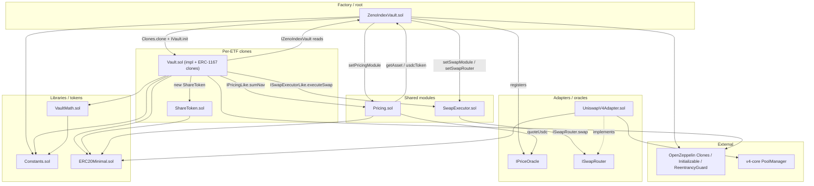

# zenoindex-evm

EVM smart contracts for Zeno Index: a clone-factory index vault that deposits a stablecoin (USDC or USDG), deploys into registered assets via a swap module, prices NAV through an oracle, and supports redeem / rebalance / write-off flows.

## Architecture overview



Production call path (simplified):

`ZenoIndexVault.createVault` → `Vault.init` → `ShareToken` → user `deposit` / `requestRedeem` → `Pricing.sumNav` + `SwapExecutor.executeSwap` → `ISwapRouter` (`UniswapV4Adapter` or mock) + `IPriceOracle`.

---

## `src/` module reference

For each Solidity file: **what it does**, then **public/external (or library) functions** and what they call or depend on.

### `src/ZenoIndexVault.sol`

**What it does:** Root factory and registry — super-admin, treasury, emergency flag, asset registry, Pricing/SwapExecutor pointers, ERC-1167 vault cloning, and Path B write-off / reactivate relays.

| Function | Dependencies / calls |
|---|---|
| `constructor(usdcToken_, treasury_, vaultImplementation_, priceOracle_)` | Sets admin + registry state |
| `setPendingSuperAdmin` / `acceptSuperAdmin` | Internal admin transfer |
| `updateTreasury` / `setEmergency` / `setEtfCreationAuthority` / `setOperator` | Super-admin config |
| `setPriceOracle` | Rotates oracle address used by vaults |
| `setPricingModule` | Stores `Pricing` singleton address |
| `setSwapModule` | Stores `SwapExecutor` singleton address |
| `setSwapRouter` | → `ISwapModAdmin(swapModule).setRouter` (`SwapExecutor`) |
| `createAsset` / `setAssetActive` / `getAsset` | Asset registry storage |
| `createVault` | → `Constants.MAX_ASSETS`; `Clones.clone` (OpenZeppelin); `IVault(clone).init` (`Vault`) |
| `confirmWriteOff` / `confirmReactivate` | → `IVault(clone).executeWriteOff` / `executeReactivate` |
| `setVaultEmergencyLock` | → `Vault(clone).setVaultEmergencyLock` |

Also implements `IZenoIndexVault` view surface (`usdcToken`, `treasury`, `pricingModule`, `swapModule`, `priceOracle`, `getAsset`, …).

---

### `src/Vault.sol`

**What it does:** Per-ETF ERC-1167 clone implementation — genesis, deposit, redeem/claim, USDC→asset deployment swaps, asset→USDC redeem swaps, target allocations, rebalance, and Path B write-off/reactivate execution. Reads modules and registry live from `ZenoIndexVault` (never caches).

| Function | Dependencies / calls |
|---|---|
| `init(...)` | → `Constants` fee bounds / BPS; `new ShareToken`; OpenZeppelin `Initializable` |
| `setPaused` / `setFeeRecipient` | Manager-only control |
| `setVaultEmergencyLock` | Called only by `ZenoIndexVault` |
| `assetIdAt` / `allocationBpsAt` / `usdcTargetAmountAt` / `reservedAt` | Slot getters |
| `genesisDeposit` | → `VaultMath.calculateReverseGenesisShares`; `Constants.GENESIS_SEED_USDC`; `IZenoIndexVault.usdcToken`; `ERC20Minimal.transferFrom`; `ShareToken.mint`; `_recordPendingTargets` |
| `deposit` | → `_sumNav` → `Pricing.sumNav`; `VaultMath.computeSharesToMint` / `computeUsdcForShares` / `computeFeeSplit`; `ERC20Minimal.transferFrom`; `_payFees`; `ShareToken.mint`; `_recordPendingTargets` |
| `previewDeposit` | → `VaultMath.computeFeeSplit` / `computeSharesToMint`; `_sumNav` |
| `totalNav` | → `_sumNav` + `totalPendingUsdc` |
| `requestRedeem` | → `IZenoIndexVault.getAsset`; `ERC20Minimal.balanceOf`; `VaultMath.computeRedeemSwapAmounts` / `computePendingCarve`; `ShareToken.burn` |
| `getRedeemState` / `getRedeemAssetAmount` | Redeem views |
| `claim` | → `VaultMath.computeFeeSplit`; `_payFees`; `ERC20Minimal.transfer`; `_resetRedeem` |
| `swapUsdcToAsset` | → `IZenoIndexVault.getAsset` / `usdcToken` / `swapModule`; `ISwapExecutorLike.router` / `executeSwap`; `ERC20Minimal.approve` |
| `swapAssetToUsdc` | Same swap path as above for redeem unwind |
| `setTargetAllocations` | → `Constants.MAX_ASSETS` / `BPS_DENOM` |
| `executeRebalance` | → `_sumNav`; `IZenoIndexVault.getAsset` / `usdcToken` / `swapModule`; `IPriceOracleLike.quoteUsdc`; `ISwapExecutorLike.executeSwap`; `Constants.REBALANCE_DRIFT_BPS`; may `_retireSlot` |
| `proposeWriteOff` / `proposeReactivate` | Manager proposes Path B |
| `executeWriteOff` / `executeReactivate` | Called by `ZenoIndexVault`; → oracle / `ERC20Minimal` / `_retireSlot` |

Internal helpers of note: `_sumNav` → `Pricing.sumNav`; `_payFees` → `IZenoIndexVault.treasury` + `ERC20Minimal.transfer`; `_recordPendingTargets` → `VaultMath.allocationSlice`.

Imports: OpenZeppelin `Initializable`, `ReentrancyGuard`; `IZenoIndexVault`, `IVault`, `ISwapRouter`; `ERC20Minimal`, `ShareToken`, `VaultMath`, `Constants`.

---

### `src/Pricing.sol`

**What it does:** Stateless NAV valuation singleton — sums free (non-reserved) vault balances in USDC 6-decimal units.

| Function | Dependencies / calls |
|---|---|
| `sumNav(...)` | → `IZenoIndexVault.usdcToken` / `getAsset`; `ERC20Minimal.balanceOf`; USDC legs valued 1:1; non-USDC legs → `IPriceOracle.quoteUsdc` |

---

### `src/SwapExecutor.sol`

**What it does:** Singleton swap orchestrator. Holds the current `ISwapRouter` address; vaults call it to execute swaps without custodied tokens.

| Function | Dependencies / calls |
|---|---|
| `constructor(zenoIndexVault_)` | Binds factory as sole admin of router updates |
| `setRouter` | Only `ZenoIndexVault`; updates `router` |
| `executeSwap` | → `ISwapRouter(router).swap` |

---

### `src/adapters/UniswapV4Adapter.sol`

**What it does:** Production `ISwapRouter` adapter that chains exact-input hops through a Uniswap V4 `PoolManager` using admin-registered per-pair pools.

| Function | Dependencies / calls |
|---|---|
| `constructor(poolManager_, admin_)` | → `v4-core` `IPoolManager` |
| `setAdmin` | Admin rotation |
| `setPool` | Registers `PoolKey` (`Currency`, `IHooks`, fee, tickSpacing) |
| `swap` | → `ERC20Minimal.transferFrom`; `poolManager.unlock` |
| `unlockCallback` | → `poolManager.swap` / `sync` / `settle` / `take`; `ERC20Minimal.transfer`; `TickMath`, `BalanceDelta` (v4-core) |

---

### `src/libraries/VaultMath.sol`

**What it does:** Pure fee, share-pricing, redeem-carve, and allocation math used by `Vault`.

| Function | Dependencies / calls |
|---|---|
| `computeFeeSplit` | → `Constants.BPS_DENOM`, `COMPANY_FEE_SHARE_BPS` |
| `calculateReverseGenesisShares` | → `Constants.PRICE_SCALE`, baseline bounds |
| `computeSharesToMint` | Pure NAV math |
| `computeUsdcForShares` | Fixed-vault share-cap clamp |
| `computeSharePrice` | → `Constants.PRICE_SCALE` |
| `proRataAmount` | Share-pro-rata helper |
| `computeRedeemSwapAmounts` | → `proRataAmount`, `Constants.MAX_ASSETS` |
| `computePendingCarve` | → `proRataAmount`, pending USDC carve |
| `allocationSlice` | → `Constants.BPS_DENOM` |

---

### `src/libraries/Constants.sol`

**What it does:** Protocol-wide constants (asset cap, price scale, genesis seed, fee bounds, company fee share, rebalance drift band). No functions — only `internal constant` values consumed by `Vault`, `ZenoIndexVault`, and `VaultMath`.

Key symbols: `MAX_ASSETS`, `PRICE_SCALE`, `GENESIS_SEED_USDC`, `MIN/MAX_BASELINE_SHARE_PRICE`, `MAX_DEPOSIT_FEE_BPS`, `MIN/MAX_REDEEM_FEE_BPS`, `COMPANY_FEE_SHARE_BPS`, `BPS_DENOM`, `REBALANCE_DRIFT_BPS`.

---

### `src/tokens/ERC20Minimal.sol`

**What it does:** Minimal ERC-20 used as the base for share tokens and mock assets.

| Function | Dependencies / calls |
|---|---|
| `approve` / `transfer` / `transferFrom` | Local allowance + balance accounting |
| `_transfer` / `_mint` / `_burn` | Internal supply helpers (used by `ShareToken` / mocks) |

---

### `src/tokens/ShareToken.sol`

**What it does:** Vault-owned share ERC-20 (6 decimals). Only the owning vault may mint/burn.

| Function | Dependencies / calls |
|---|---|
| `constructor` | → `ERC20Minimal` |
| `mint` / `burn` | → `ERC20Minimal._mint` / `_burn` (onlyVault) |

---

### `src/interfaces/IZenoIndexVault.sol`

**What it does:** Read/call surface vault clones use to reach the root factory (treasury, USDC/USDG token, modules, oracle, asset registry, roles).

| Function | Dependencies / calls |
|---|---|
| `superAdmin` / `treasury` / `usdcToken` / `isEmergency` / `pricingModule` / `swapModule` / `priceOracle` / `isOperator` / `etfCreationAuthority` / `getAsset` | Interface only — implemented by `ZenoIndexVault` |

---

### `src/interfaces/IVault.sol`

**What it does:** Surface the factory uses on vault clones for init and Path B relays.

| Function | Dependencies / calls |
|---|---|
| `init` / `executeWriteOff` / `executeReactivate` | Interface only — implemented by `Vault` |

---

### `src/interfaces/IPriceOracle.sol`

**What it does:** Injectable price adapter (`quoteUsdc`) returning USDC 6-decimal value.

| Function | Dependencies / calls |
|---|---|
| `quoteUsdc(token, amount)` | Implemented by `MockPriceOracle` (tests) or a production oracle |

---

### `src/interfaces/ISwapRouter.sol`

**What it does:** DEX adapter interface for multi-hop exact-input swaps.

| Function | Dependencies / calls |
|---|---|
| `swap(path, amountIn, minAmountOut, from, to)` | Implemented by `UniswapV4Adapter` / `MockSwapRouter` |

---

### `src/mocks/MockERC20.sol`

**What it does:** Test ERC-20 with public `mint`. Extends `ERC20Minimal`.

| Function | Dependencies / calls |
|---|---|
| `mint` | → `ERC20Minimal._mint` |

---

### `src/mocks/MockPriceOracle.sol`

**What it does:** Test `IPriceOracle` with manually set numerators/denominators.

| Function | Dependencies / calls |
|---|---|
| `setPrice` / `setPriceWhole` | Local price tables; `setPriceWhole` → `ERC20Minimal.decimals` |
| `quoteUsdc` | Implements `IPriceOracle` |

---

### `src/mocks/MockSwapRouter.sol`

**What it does:** Test `ISwapRouter` with fixed per-pair rates along a hop path.

| Function | Dependencies / calls |
|---|---|
| `setRate` | Local rate table |
| `swap` | → `ERC20Minimal.transferFrom` / `transfer`; implements `ISwapRouter` |

---

## Documentation

https://book.getfoundry.sh/

## Usage

### Build

```shell
$ forge build
```

### Test

```shell
$ forge test
```

### Format

```shell
$ forge fmt
```

### Gas Snapshots

```shell
$ forge snapshot
```

### Anvil

```shell
$ anvil
```

### Deploy

```shell
$ forge script script/Deploy.s.sol:Deploy --rpc-url $RH_RPC_URL --broadcast --chain-id 46630 -vvvv
```

Required env: `PRIVATE_KEY`, `STABLECOIN` (USDC or USDG address). See `script/Deploy.s.sol` and `.env.example`.

### Cast

```shell
$ cast <subcommand>
```

### Help

```shell
$ forge --help
$ anvil --help
$ cast --help
```

### README ↔ `src/` coverage check

```shell
$ bash script/check-readme-src-docs.sh
```
