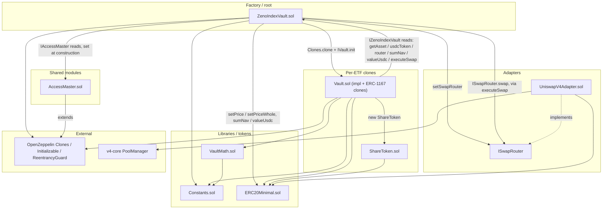

# zenoindex-evm

EVM smart contracts for Zeno Index: a clone-factory index vault that deposits a stablecoin (USDC or USDG), deploys into registered assets through Uniswap V4, values NAV from an admin-pushed price table, and supports redeem / rebalance / write-off flows.

## Architecture overview



Production call path (simplified):

Allowlisted `ZenoIndexVault.createVault` → `Vault.init` → `ShareToken` → user `deposit` / `requestRedeem` → `ZenoIndexVault.sumNav` + `ZenoIndexVault.executeSwap` → `UniswapV4Adapter`.

NAV, prices, and swap execution live on `ZenoIndexVault`. Roles and treasury live on `AccessMaster` and are read live via `IAccessMaster`. Every production vault should include a USDC basket slot so rebalance cash stays in NAV — see [docs/MAINNET_REVIEW.md](docs/MAINNET_REVIEW.md).

---

## `src/` module reference

For each Solidity file: **what it does**, then **public/external (or library) functions** and what they call or depend on.

### `src/ZenoIndexVault.sol`

**What it does:** Root factory and registry — emergency flag, asset registry, admin price table, swap execution, ERC-1167 vault cloning, and Path B write-off / reactivate / sweep relays. Holds no admin/operator/treasury storage of its own — `superAdmin` / `isOperator` / `treasury` are read live from `AccessMaster` (set once at construction) via `IAccessMaster`.

| Function | Dependencies / calls |
|---|---|
| `constructor(usdcToken_, vaultImplementation_, accessMaster_)` | Sets registry state + binds `accessMaster` |
| `superAdmin` / `isOperator` / `treasury` | → `IAccessMaster(accessMaster)` passthrough views |
| `setEmergency` | Super-admin config (`onlySuperAdmin` → `AccessMaster`). Emergency halts `createVault`, genesis, deposits and every swap (`executeSwap`); `setPrice` and in-kind redeem exits stay open |
| `setUsdcToken` | `onlySuperAdmin`; reverts `VaultsExist` once any vault has been created |
| `setPrice` / `setPriceWhole` | Sets the per-token USDC price table (`onlySuperAdmin`). Rejects a zero price and any single move larger than `maxPriceChangeBps`; stamps `priceUpdatedAt` |
| `setMaxPriceAge` / `setMaxPriceChangeBps` / `setMaxSwapSlippageBps` | `onlySuperAdmin` price-safety knobs (defaults: 1 day, 20%, 3%). Quotes older than `maxPriceAge` revert `StalePrice` |
| `setSwapRouter` | Sets the `ISwapRouter` address clones swap through (`onlySuperAdmin`) |
| `setVaultCreator` | `onlySuperAdmin` — allowlists an account that may call `createVault` |
| `setVaultOperator(vaultId, account, allowed)` | `onlySuperAdmin` — grants manager powers on **one** vault (operators are per vault) |
| `createAsset` / `setAssetActive` | Asset registry storage (`onlySuperAdminOrOperator` → `AccessMaster`) |
| `getAsset` | Asset registry read |
| `valueUsdc` | Values a token amount in USDC 6-decimal units (1:1 for `usdcToken`, price table otherwise) |
| `sumNav` | Sums a vault clone's free (non-reserved) balances in USDC 6-decimal units. USDC legs valued 1:1; non-USDC via the price table. Counts a USDC slot's `ERC20Minimal.balanceOf` after subtracting pending + escrow |
| `executeSwap` | Registered clones only (`isVaultClone`), `from == msg.sender`, not during emergency; raises `minAmountOut` to `swapFloor`; → `ISwapRouter(router).swap` |
| `swapFloor` | Price-table quote of `tokenIn → tokenOut` less `maxSwapSlippageBps` |
| `createVault` | Super-admin or `isVaultCreator` only; requires `router` set and a price for every non-USDC asset; → `Constants.MAX_ASSETS`; `Clones.clone` (OpenZeppelin); `IVault(clone).init` (`Vault`) |
| `confirmWriteOff` / `confirmReactivate` | → `IVault(clone).executeWriteOff` / `executeReactivate` |
| `sweepWrittenOff(vaultId, assetId, to)` | `onlySuperAdmin` → `IVault(clone).executeSweep` — moves a written-off asset's balance out |
| `setVaultEmergencyLock` | → `Vault(clone).setVaultEmergencyLock` |

Also implements `IZenoIndexVault` view surface (`usdcToken`, `treasury`, `router`, `getAsset`, `valueUsdc`, `sumNav`, …).

---

### `src/Vault.sol`

**What it does:** Per-ETF ERC-1167 clone implementation — genesis, deposit, redeem/claim, USDC→asset deployment swaps, asset→USDC redeem swaps, target allocations, rebalance, and Path B write-off/reactivate execution. Reads modules and registry live from `ZenoIndexVault` (never caches).

| Function | Dependencies / calls |
|---|---|
| `init(...)` | → `Constants` fee bounds / BPS; `new ShareToken`; OpenZeppelin `Initializable` |
| `setPaused` / `setFeeRecipient` | Manager-only control (`setFeeRecipient` rejects `address(0)`). "Manager" = `vaultManager` or an operator scoped to this vault via `ZenoIndexVault.setVaultOperator` |
| `setVaultEmergencyLock` | Called only by `ZenoIndexVault` |
| `assetIdAt` / `allocationBpsAt` / `usdcTargetAmountAt` / `reservedAt` | Slot getters |
| `genesisDeposit` | Halts on pause / admin lock / emergency; → `VaultMath.calculateReverseGenesisShares`; `Constants.GENESIS_SEED_USDC`; `IZenoIndexVault.usdcToken`; `SafeERC20.safeTransferFrom`; `ShareToken.mint`; `_recordPendingTargets` |
| `deposit` | Halts on pause / admin lock / emergency; → `_quoteDeposit` (`_sumNav`, `VaultMath.computeSharesToMint` / `computeUsdcForShares` / `computeFeeSplit`, share-cap clamp); `SafeERC20.safeTransferFrom`; `_payFees`; `ShareToken.mint`; `_recordPendingTargets(fee.netAmount)` |
| `previewDeposit` | → `_quoteDeposit` — identical math to `deposit`, including the share-cap clamp |
| `totalNav` | → `_sumNav` + `totalPendingUsdc` |
| `requestRedeem` | → `_freeBalance` (a USDC slot excludes pending + escrowed cash); `VaultMath.computeRedeemSwapAmounts` / `computePendingCarve`; `ShareToken.burn`. A USDC slot's share is credited to escrow directly; reverts `ZeroAmount` if every leg rounds to 0 |
| `getRedeemState` / `getRedeemAssetAmount` | Redeem views |
| `claim` | Requires every leg swapped; → `_payOutEscrow` (`VaultMath.computeFeeSplit`, `_payFees`, `SafeERC20`); `_resetRedeem`. A zero escrow still closes the redeem |
| `claimInKind` | Redeemer closes their redeem without swapping: unswapped legs paid in the asset (redeem fee taken in-kind) + escrowed USDC. Works during pause / lock / emergency |
| `forceSettleRedeem(user)` | Anyone, after `Constants.REDEEM_TIMEOUT` (7 days): settles `user`'s redeem in-kind to `user` |
| `swapUsdcToAsset` | Manager; halts on pause / lock / emergency; → `_swap` (`forceApprove` exact amount → `IZenoIndexVault.executeSwap` → reset approval; output measured by balance delta) |
| `swapAssetToUsdc` | Redeemer's unwind leg; halts on admin lock / emergency; same `_swap` path |
| `setTargetAllocations` | → `Constants.MAX_ASSETS` / `BPS_DENOM` |
| `executeRebalance` | Manager; halts on pause / lock / emergency. Target > 0: trades the delta outside `Constants.REBALANCE_DRIFT_BPS` (`_rebalanceTowardTarget`). Target 0: sells the **whole** free balance, then retires the slot once at most `Constants.RETIRE_DUST_USDC` is left (and no redeem is active) |
| `proposeWriteOff` / `proposeReactivate` | Manager proposes Path B |
| `executeWriteOff` / `executeReactivate` | Called by `ZenoIndexVault`; → `IZenoIndexVault.valueUsdc` (informational, best-effort) / `ERC20Minimal` / `_retireSlot`. USDC can't be written off |
| `executeSweep(assetId, to)` | Called by `ZenoIndexVault.sweepWrittenOff`; transfers a written-off asset's balance to `to` |

Internal helpers of note: `_sumNav` → `ZenoIndexVault.sumNav`; `_payFees` → `IZenoIndexVault.treasury` + `SafeERC20.safeTransfer`; `_recordPendingTargets` → `VaultMath.allocationSlice`; `_swap` (exact approve, balance-delta output); `_quoteDeposit`; `_freeBalance`; `_settleInKind`.

Imports: OpenZeppelin `Initializable`, `ReentrancyGuard`, `IERC20`, `SafeERC20`; `IZenoIndexVault`, `IVault`; `ERC20Minimal`, `ShareToken`, `VaultMath`, `Constants`. Deposit path: `VaultMath.computeSharesToMint` → `ShareToken.mint` → `_sumNav` → `ZenoIndexVault.sumNav` → `IZenoIndexVault.executeSwap`.

---

### `src/AccessMaster.sol`

**What it does:** Singleton role + treasury registry — the sole source of truth for who is admin, who is an operator, and where fees go, across the protocol. Wraps OpenZeppelin `AccessControl` directly — `ADMIN_ROLE` is an explicit alias for `DEFAULT_ADMIN_ROLE` with exactly one holder, always equal to `superAdmin()`. It moves in **two steps**: the current super-admin proposes via `setSuperAdmin`, and the new admin takes it with `acceptSuperAdmin` (a wrong proposal is fixed by proposing again). OZ's public `grantRole` / `revokeRole` / `renounceRole` revert for `ADMIN_ROLE`, so the role and `superAdmin()` can't drift apart. `OPERATOR_ROLE` is granted/revoked via named `addOperator` / `removeOperator` wrappers (OZ's own `grantRole` / `revokeRole` remain usable for it). A global operator only manages the asset registry — vault manager powers are granted per vault on `ZenoIndexVault`. `superAdmin()` / `isOperator()` are read-only aliases over the same OZ state, for the vocabulary `ZenoIndexVault.sol` already reads live via `IAccessMaster`. `ZenoIndexVault` reads roles + treasury live instead of storing them itself.

| Function | Dependencies / calls |
|---|---|
| `constructor(initialSuperAdmin, initialTreasury)` | → OpenZeppelin `AccessControl._grantRole(ADMIN_ROLE, initialSuperAdmin)`; sets `treasury` |
| `superAdmin` | Read alias over the tracked single `ADMIN_ROLE` holder |
| `setSuperAdmin` | `onlyRole(ADMIN_ROLE)` — proposes `pendingSuperAdmin` |
| `acceptSuperAdmin` | `pendingSuperAdmin` only — revokes the old admin, grants the caller, updates `superAdmin()` |
| `isOperator` | → `hasRole(OPERATOR_ROLE, account)` (read alias) |
| `addOperator` / `removeOperator` | `onlyRole(ADMIN_ROLE)` — `_grantRole` / `_revokeRole(OPERATOR_ROLE, account)` |
| `treasury` | Public state, set at construction |
| `setTreasury` | `onlyRole(ADMIN_ROLE)` |
| `grantRole` / `revokeRole` / `renounceRole` | OZ `AccessControl` overrides — revert `AdminRoleManagedBySetSuperAdmin` for `ADMIN_ROLE`, otherwise unchanged |

Implements `IAccessMaster`.

---

### `src/adapters/UniswapV4Adapter.sol`

**What it does:** Production `ISwapRouter` adapter that chains exact-input hops through a Uniswap V4 `PoolManager` using admin-registered per-pair pools. `swap` pulls from an arbitrary `from`, so only admin-authorized callers (the `ZenoIndexVault` factory) may call it.

| Function | Dependencies / calls |
|---|---|
| `constructor(poolManager_, admin_)` | → `v4-core` `IPoolManager` |
| `setAdmin` | Admin rotation |
| `setAuthorizedCaller` | Admin — allowlists a contract that may call `swap` (authorize `ZenoIndexVault` after deploy) |
| `setHookAllowed` | Admin — allowlists a V4 hook contract |
| `setPool` | Registers `PoolKey` (`Currency`, `IHooks`, fee, tickSpacing); `hooks` must be `address(0)` or allowlisted |
| `swap` | Authorized callers only; → `SafeERC20.safeTransferFrom`; `poolManager.unlock` |
| `unlockCallback` | → `poolManager.swap` / `sync` / `settle` / `take`; `SafeERC20.safeTransfer`; `TickMath`, `BalanceDelta` (v4-core) |

---

### `src/libraries/VaultMath.sol`

**What it does:** Pure fee, share-pricing, redeem-carve, and allocation math used by `Vault`.

| Function | Dependencies / calls |
|---|---|
| `computeFeeSplit` | → `Constants.BPS_DENOM`, `COMPANY_FEE_SHARE_BPS` |
| `calculateReverseGenesisShares` | → `Constants.PRICE_SCALE`, baseline bounds |
| `computeSharesToMint` | Pure NAV math |
| `computeUsdcForShares` | Fixed-vault share-cap clamp |
| `computeSharePrice` | → `Constants.PRICE_SCALE` |
| `proRataAmount` | Share-pro-rata helper |
| `computeRedeemSwapAmounts` | → `proRataAmount`, `Constants.MAX_ASSETS` |
| `computePendingCarve` | → `proRataAmount`, pending USDC carve |
| `allocationSlice` | → `Constants.BPS_DENOM` |

---

### `src/libraries/Constants.sol`

**What it does:** Protocol-wide constants (asset cap, price scale, genesis seed, fee bounds, company fee share, rebalance drift band, retire dust, redeem timeout). No functions — only `internal constant` values consumed by `Vault`, `ZenoIndexVault`, and `VaultMath`.

Key symbols: `MAX_ASSETS`, `PRICE_SCALE`, `GENESIS_SEED_USDC`, `MIN/MAX_BASELINE_SHARE_PRICE`, `MAX_DEPOSIT_FEE_BPS`, `MIN/MAX_REDEEM_FEE_BPS`, `COMPANY_FEE_SHARE_BPS`, `BPS_DENOM`, `REBALANCE_DRIFT_BPS`, `RETIRE_DUST_USDC`, `REDEEM_TIMEOUT`.

---

### `src/tokens/ERC20Minimal.sol`

**What it does:** Minimal ERC-20 used as the base for share tokens and mock assets.

| Function | Dependencies / calls |
|---|---|
| `approve` / `transfer` / `transferFrom` | Local allowance + balance accounting |
| `_transfer` / `_mint` / `_burn` | Internal supply helpers (used by `ShareToken` / mocks) |

---

### `src/tokens/ShareToken.sol`

**What it does:** Vault-owned share ERC-20 (6 decimals). Only the owning vault may mint/burn.

| Function | Dependencies / calls |
|---|---|
| `constructor` | → `ERC20Minimal` |
| `mint` / `burn` | → `ERC20Minimal._mint` / `_burn` (onlyVault) |

---

### `src/interfaces/IAccessMaster.sol`

**What it does:** Read surface `AccessMaster.sol` exposes for role and treasury checks (`superAdmin`, `isOperator`, `treasury`).

| Function | Dependencies / calls |
|---|---|
| `superAdmin` / `isOperator(account)` / `treasury` | Interface only — implemented by `AccessMaster` |

---

### `src/interfaces/IZenoIndexVault.sol`

**What it does:** Read/call surface vault clones use to reach the root factory (treasury, USDC/USDG token, router, price table, asset registry, roles).

| Function | Dependencies / calls |
|---|---|
| `superAdmin` / `treasury` / `usdcToken` / `isEmergency` / `router` / `isOperator` / `isVaultOperator` / `getAsset` / `valueUsdc` / `sumNav` / `executeSwap` | Interface only — implemented by `ZenoIndexVault` |

---

### `src/interfaces/IVault.sol`

**What it does:** Surface the factory uses on vault clones for init and Path B relays.

| Function | Dependencies / calls |
|---|---|
| `init` / `executeWriteOff` / `executeReactivate` / `executeSweep` | Interface only — implemented by `Vault` |

---

### `src/interfaces/ISwapRouter.sol`

**What it does:** DEX adapter interface for multi-hop exact-input swaps.

| Function | Dependencies / calls |
|---|---|
| `swap(path, amountIn, minAmountOut, from, to)` | Implemented by `UniswapV4Adapter` / `MockSwapRouter` |

---

### `src/mocks/MockERC20.sol`

**What it does:** Test ERC-20 with public `mint`. Extends `ERC20Minimal`.

| Function | Dependencies / calls |
|---|---|
| `mint` | → `ERC20Minimal._mint` |

---

### `src/mocks/MockSwapRouter.sol`

**What it does:** Test `ISwapRouter` with fixed per-pair rates along a hop path.

| Function | Dependencies / calls |
|---|---|
| `setRate` | Local rate table |
| `swap` | → `ERC20Minimal.transferFrom` / `transfer`; implements `ISwapRouter` |

---

## Documentation

- [docs/MAINNET_REVIEW.md](docs/MAINNET_REVIEW.md) — go-ahead, bugs fixed, remaining audit findings, coverage
- [Foundry book](https://book.getfoundry.sh/)

## Usage

### Build

```shell
$ forge build
```

### Test

```shell
$ forge test
```

### Format

```shell
$ forge fmt
```

### Gas Snapshots

```shell
$ forge snapshot
```

### Anvil

```shell
$ anvil
```

### Deploy

```shell
$ forge script script/Deploy.s.sol:Deploy --rpc-url $RH_RPC_URL --broadcast --chain-id 46630 -vvvv
```

Required env: `PRIVATE_KEY`, `STABLECOIN` (USDC or USDG address). After broadcast, authorize the adapter, set the router and prices, allow vault creators, then create vaults **with a USDC basket slot**. See `script/Deploy.s.sol`, `.env.example`, and [docs/MAINNET_REVIEW.md](docs/MAINNET_REVIEW.md).

### Cast

```shell
$ cast <subcommand>
```

### Help

```shell
$ forge --help
$ anvil --help
$ cast --help
```

### README ↔ `src/` coverage check

```shell
$ bash script/check-readme-src-docs.sh
```
